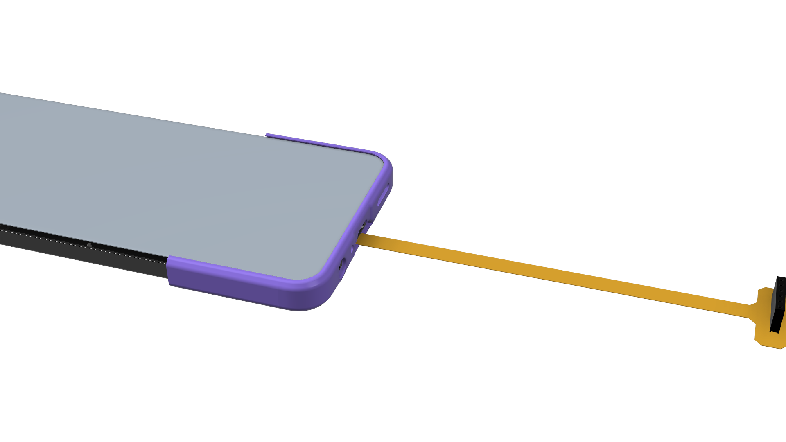

# HMD-Fusion-DIY-Cases
A repo for storing my progress into developing a case/outift for the HMD Fusion phone. 

## Basic Start
### The breakout board

The breakout board is used to breakout the 6 pin header on the back of the phone and expand it into the ISO standard 2.54mm/0.1" 6 pin header for breadboard testing and development of circuits. 

There is a case to go with this, it is best printed in TPU or other flexible materials to ensure the spring loaded pins on the breakout board do not get bent or damaged when removing the case from the phone. 
